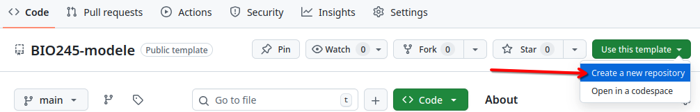
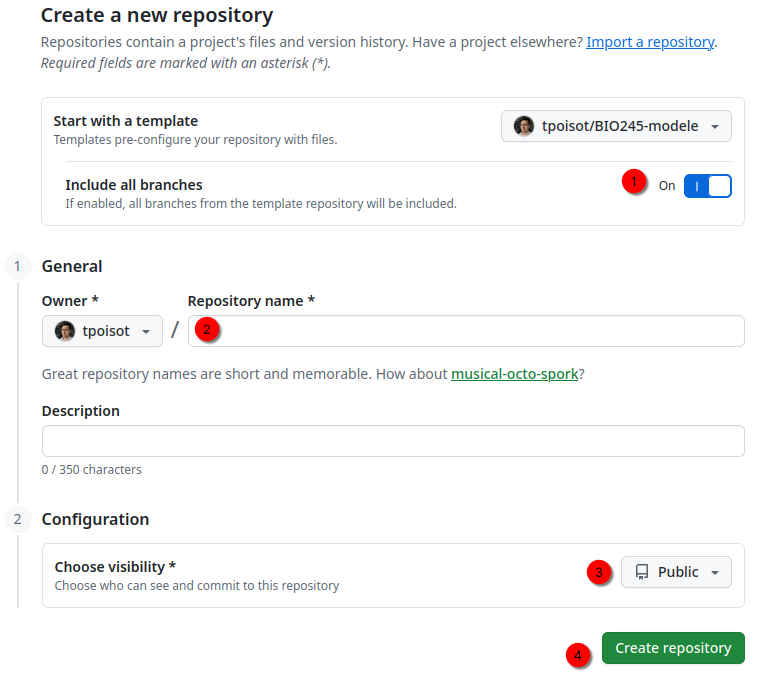
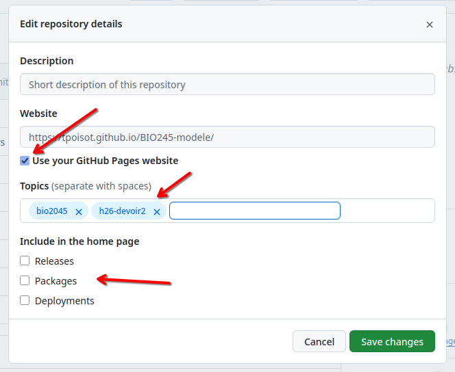

# Dépôt modèle pour le cours BIO 2045

<!-- Vous devrez supprimer les instructions, incluant ce commentaire -->

⚠️ **Important**: Vous devrez mettre à jour le document `README.md`, pour enlever les instructions d'installation, et ajouter les informations pertinentes pour le projet

ℹ️ **Information**: [Guide d'utilisation de markdown](https://docs.github.com/en/get-started/writing-on-github/getting-started-with-writing-and-formatting-on-github/basic-writing-and-formatting-syntax)

_Pour utiliser ce modèle, vous devez utiliser l'option "Use this template", puis "Create a new repository"_

_Vous devrez ensuite vous assurer que l'option "Include all branches" est cochée, puis choisir le nom du dépôt, et vous assurer qu'il soit visible, avant de le publier_

_Une fois que le dépôt est créé, vous devrez ajouter quelques informations à votre dépôt_

_Les informations doivent être les suivantes. Les tags `bio2045` et `h26-devoir2` (ou `h26-devoir3`) sont essentiels!_

<!-- Vous devrez supprimer jusqu'à, et incluant ce commentaire -->

## Organisation du projet

## ETC