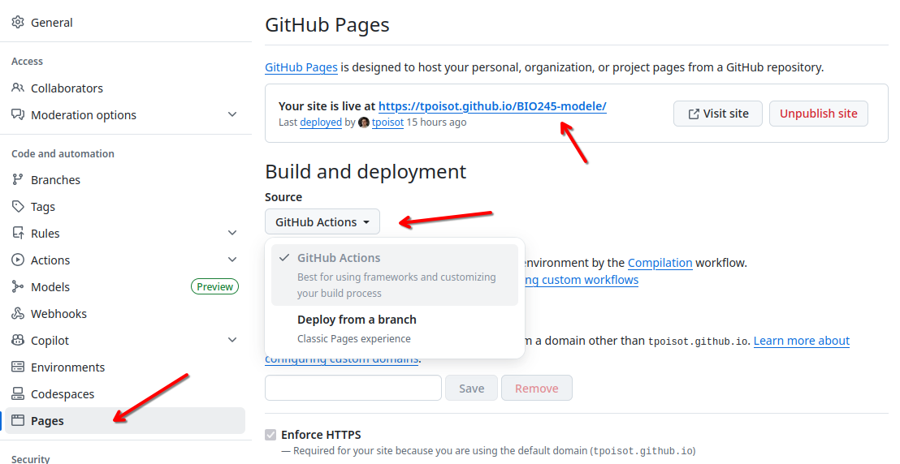
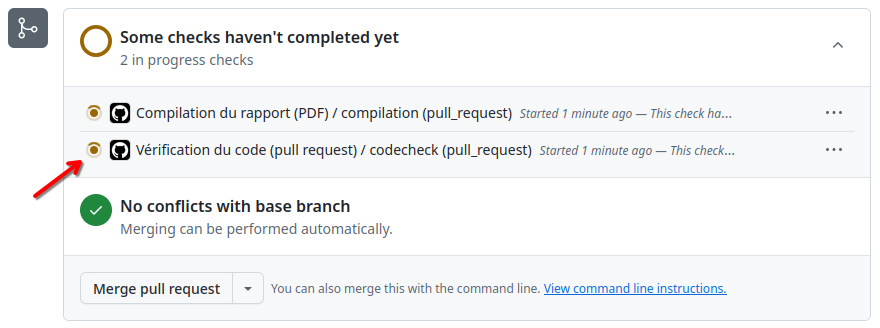
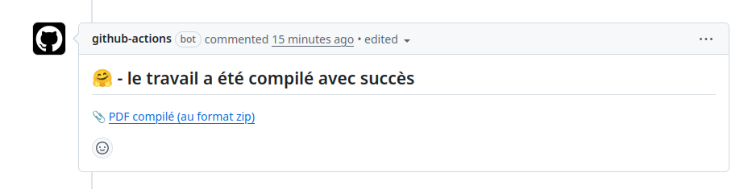

# Dépôt modèle pour le cours BIO 2045

<!-- Vous devrez supprimer les instructions, incluant ce commentaire -->

⚠️ **Important**: Le document compilé (`travail.pdf`) se trouve à `username.github.io/nom_du_repo/travail.pdf`

⚠️ **Important**: Vous devrez mettre à jour le document `README.md`, pour enlever les instructions d'installation, et ajouter les informations pertinentes pour le projet

⚠️ **Important**: Vous devrez utiliser le document `travail.jl` pour écrire votre code / rapport, et **vous ne pouvez pas le renommer**

ℹ️ **Information**: [Guide d'utilisation de markdown](https://docs.github.com/en/get-started/writing-on-github/getting-started-with-writing-and-formatting-on-github/basic-writing-and-formatting-syntax)

ℹ️ **Information**: Les références doivent aller dans le fichier `references.bib` au format bibtex, qui peut être généré par [Zotero](https://www.zotero.org/) ou [zoterobib](https://zbib.org/)

_Pour utiliser ce modèle, vous devez utiliser l'option "Use this template", puis "Create a new repository"_

_Vous devrez ensuite vous assurer que l'option "Include all branches" est cochée, puis choisir le nom du dépôt, et vous assurer qu'il soit visible, avant de le publier_

_Une fois que le dépôt est créé, vous devrez ajouter quelques informations à votre dépôt_

_Les informations doivent être les suivantes. Les tags `bio2045` et `h26-devoir2` (ou `h26-devoir3`) sont essentiels!_

_Vous devrez mettre à jour les options dans le menu "Pages" - la source doit être GitHub Actions_

---

⚠️ **Important**: Ce projet a été mis à jour pour le devoir 3.

Les pull request font maintenant une vérification du code:

Vous pouvez attendre que cette vérification soit faite avant de merger la pull
request. Cette vérification est _plus stricte_ que la génération du PDF, et
renvoie un message en cas d'erreur. Si cette vérification se termine avec
succès, votre code peut s'éxécuter. Si cette vérification échoue, vous pouvez
cliquer sur l'erreur pour voir la raison.

En parallèle, la pull request va aussi générer le PDF tel qu'il serait produit
après avoir été inclus dans la branche vers laquelle vous envoyez les
changements. Quand la génération du PDF est terminée, un nouveau message sera
ajouté à la pull request.

<!-- Vous devrez supprimer jusqu'à, et incluant ce commentaire -->

## Organisation du projet

## ETC